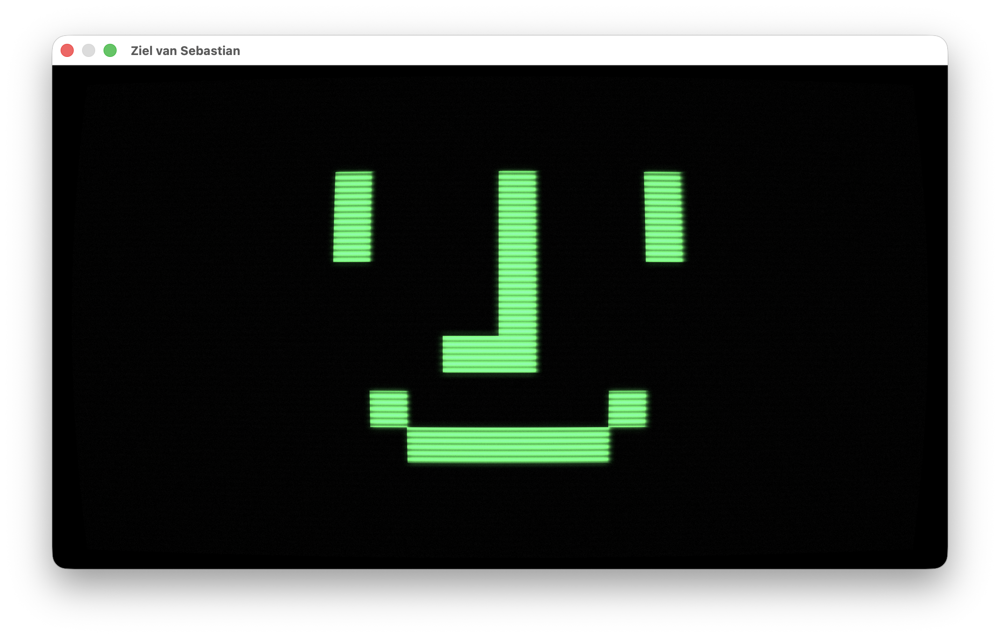
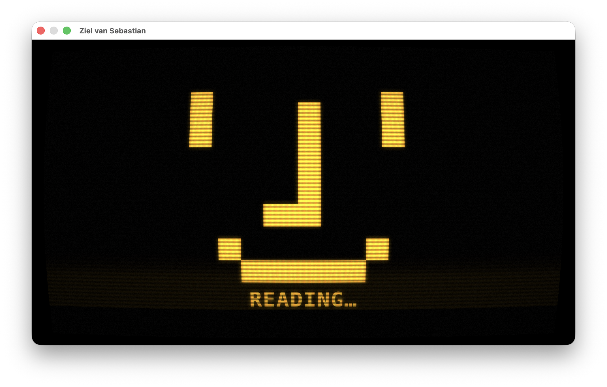
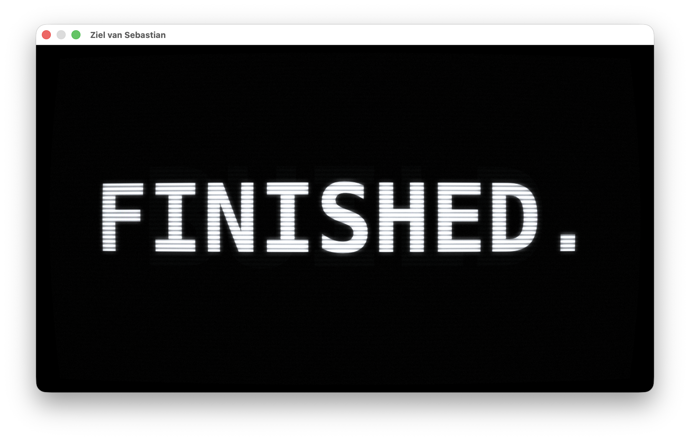
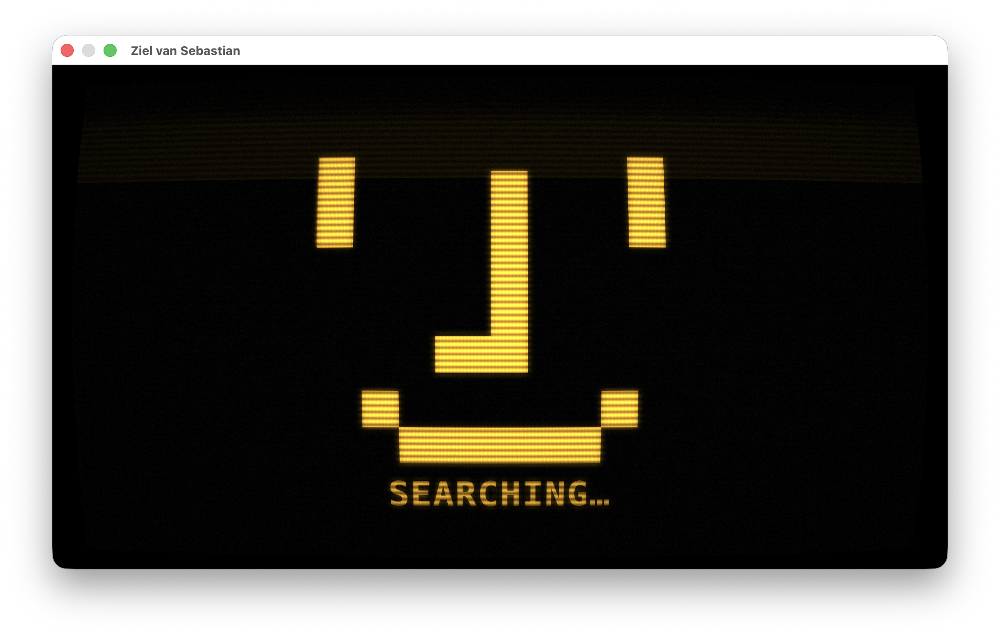

# Ziel van Sebastian

A CRT soul for a Mac mini appliance. The Wokyis M5 dock looks like a 1984
Macintosh; this app completes it: the happy-Mac face idles on a simulated
phosphor tube, wakes amber when OpenClaw thinks, and speaks replies one big
glowing word at a time.

*Media above uses a heavier-than-default shader config so the CRT effects survive image scaling — defaults in [config.example.json](config.example.json) are subtler. Every knob is live-tunable.*

## What it looks like

| Idle | Thinking |
|---|---|
|  |  |

| Speaking | Demo under the CRT pipeline |
|---|---|
|  |  |

## Build

    brew install xcodegen
    make build          # builds the app + mock-gateway
    make test           # unit + integration tests
    make run            # windowed demo loop, no gateway needed

## Configure

    mkdir -p ~/Library/Application\ Support/Ziel\ van\ Sebastian
    cp config.example.json ~/Library/Application\ Support/Ziel\ van\ Sebastian/config.json
    # put your OpenClaw gateway token in it

Config is watched: shader knobs and pacing reload live while the app runs
(edit the file in place; delete+recreate is not detected until restart).

## Run against a mock gateway

    ./build/Build/Products/Debug/mock-gateway --scenario MockGateway/Scenarios/happy-path.json
    "./build/Build/Products/Debug/Ziel van Sebastian.app/Contents/MacOS/Ziel van Sebastian" --window

## Appliance install

    "…/Ziel van Sebastian" --install-login-item

## Flags

| Flag | Effect |
|---|---|
| `--window` | 960×540 window instead of claiming a display |
| `--demo` | looping scripted lifecycle, no gateway |
| `--state thinking\|speaking\|offline` | jump to a state for tuning |
| `--config <path>` | alternate config file |
| `--install-login-item` | register for launch at login |

## License

MIT — see [LICENSE](LICENSE).
