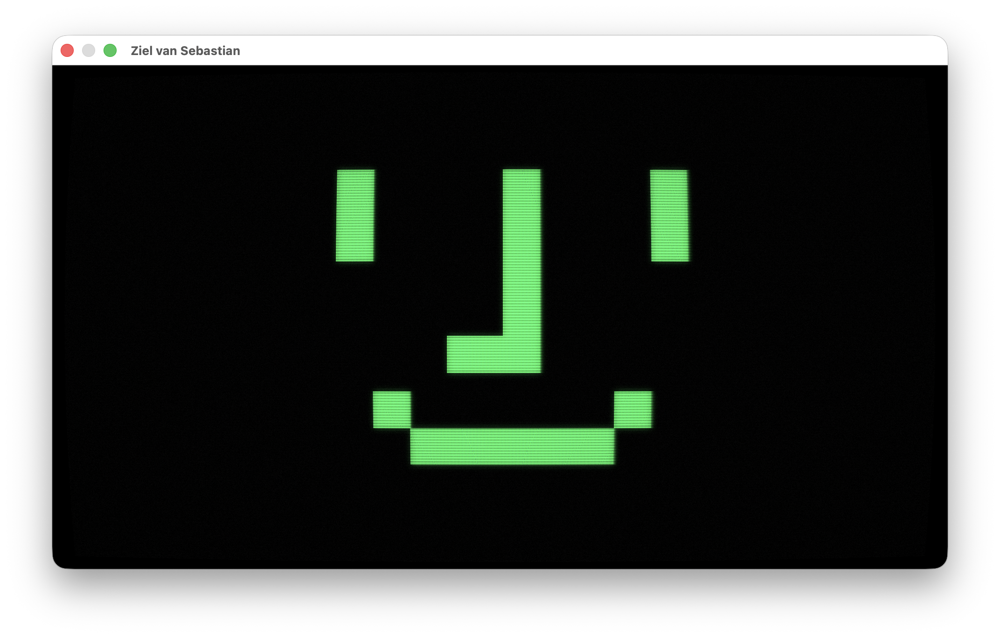

# Ziel van Sebastian

A CRT soul for a Mac mini appliance. The Wokyis M5 dock looks like a 1984
Macintosh; this app completes it: the happy-Mac face idles on a simulated
phosphor tube, wakes amber when OpenClaw thinks, and speaks replies one big
glowing word at a time. It mirrors every conversation OpenClaw has — direct
chats stream live, and channel sessions (WhatsApp, iMessage) speak each reply
as it lands.


*Media above uses a heavier-than-default shader config so the CRT effects survive image scaling — defaults in [config.example.json](config.example.json) are subtler. Every knob is live-tunable.*

## What it looks like

| Idle | Thinking |
|---|---|
|  |  |

| Speaking | Demo under the CRT pipeline |
|---|---|
|  |  |

## Themes

The look is a named theme, selected at launch. Two built-in themes ship:

| Theme | Description |
|---|---|
| `hello` (default) | Original-Macintosh "hello." — off-white on dark warm gray, hard offset drop shadow, monochrome CRT (no RGB triads). States read through brightness: dim idle, mid thinking, bright speaking. |
| `classic` | The original Ziel look — green idle / amber thinking / white speaking phosphor on black, RGB aperture grille. |



Select in `config.json`:

```json
"look": { "theme": "classic" }
```

Or override at launch (takes precedence over config):

    "./build/…/Ziel van Sebastian" --theme classic

Any other `look` key in config acts as an override on top of the active theme — for example `"idleTint": "#ff00ff"` tints the idle state, or `"shader": { "bloomStrength": 0.8 }` cranks up the bloom. Unknown theme names fail at startup and print the list of valid ones. Switching themes requires a relaunch; the config watcher hot-reloads shader parameters only.

## Build

    brew install xcodegen
    make build          # builds the app + mock-gateway
    make test           # unit + integration tests
    make run            # windowed demo loop, no gateway needed

## Configure

    mkdir -p ~/Library/Application\ Support/Ziel\ van\ Sebastian
    cp config.example.json ~/Library/Application\ Support/Ziel\ van\ Sebastian/config.json
    # put your OpenClaw gateway token in it

Config is watched: shader knobs and pacing reload live while the app runs
(edit the file in place; delete+recreate is not detected until restart).

### Device pairing (one-time)

The app authenticates with a token **plus** an Ed25519 device identity
(generated on first run, stored next to the config). The first connect lands
in the gateway's pairing queue with empty scopes; approve it once on the
gateway host:

    openclaw devices list       # find the pending request
    openclaw devices approve <request-id>

The approval is durable for the device key — reconnects and reinstalls that
keep the identity file need no re-approval.

### Troubleshooting the gateway

    ./scripts/probe-gateway.sh           # handshake + pairing/scope verdict
    ./scripts/probe-gateway.sh ui 60     # …then listen 60s and dump live frames

The probe uses the same identity and auth path as the app; if it reports
`SCOPES GRANTED`, the app will work.

## Run against a mock gateway

    ./build/Build/Products/Debug/mock-gateway --scenario MockGateway/Scenarios/happy-path.json
    "./build/Build/Products/Debug/Ziel van Sebastian.app/Contents/MacOS/Ziel van Sebastian" --window

## Appliance install

    "…/Ziel van Sebastian" --install-login-item

## Flags

| Flag | Effect |
|---|---|
| `--window` | 960×540 window instead of claiming a display |
| `--demo` | looping scripted lifecycle, no gateway |
| `--state thinking\|speaking\|offline` | jump to a state for tuning |
| `--config <path>` | alternate config file |
| `--install-login-item` | register for launch at login |

## License

MIT — see [LICENSE](LICENSE).
